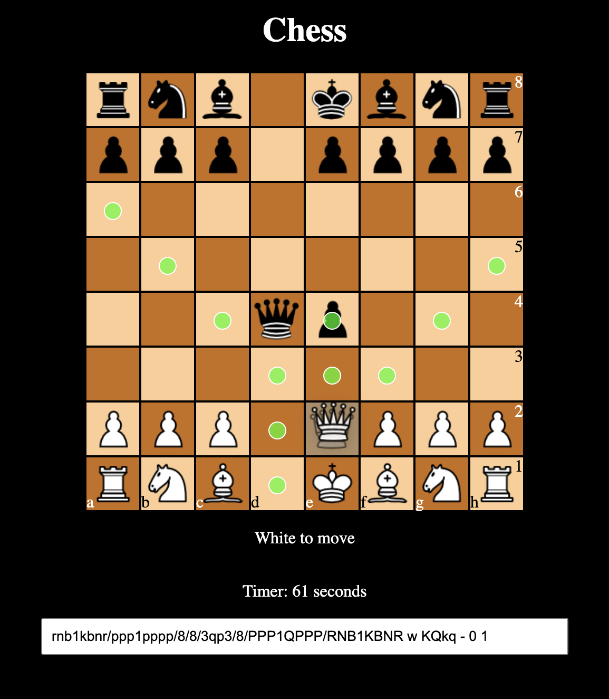

# Chess Website

This repo holds a typescript npm pkg & also a react front end which uses that pkg. 

## Chess Game Logic NPM PKG

[](https://www.npmjs.com/package/@sean_halpin/chess_game)

## React SPA Chess UI

A simple chess website built using React



### Run locally

The web client uses the local `@sean_halpin/chess_game` package. Build that
package before starting the Create React App development server.

```sh
git clone https://github.com/sean-halpin/chess_website.git
cd chess_website

cd libs/chess_game
npm ci
npm run build

cd ../../interfaces/web
npm ci
npm start
```

Open [http://localhost:3000/chess_website](http://localhost:3000/chess_website)
after the server has compiled. The project has no root npm workspace, so run
commands from the directory shown above.

### Test and validate

Run the chess-library tests and build from `libs/chess_game`:

```sh
npm test
npm run build
```

Run the web tests and lint from `interfaces/web`:

```sh
CI=true npm test -- --watchAll=false
npm run lint
```

For a production build validation that does not change package version
metadata or generate public source maps, run:

```sh
GENERATE_SOURCEMAP=false npx react-scripts build
```

### Publish to GitHub Pages

The published site is [sean-halpin.github.io/chess_website](https://sean-halpin.github.io/chess_website/).
The `homepage` setting and `gh-pages` deployment script live in
`interfaces/web/package.json`.

First, ensure the repository's **Settings → Pages** configuration deploys from
the `gh-pages` branch at the `/ (root)` directory. Then build the local chess
package, verify the web app, and deploy:

```sh
cd libs/chess_game
npm ci
npm run build

cd ../../interfaces/web
npm ci
CI=true npm test -- --watchAll=false
npm run lint
npm run deploy
```

`npm run deploy` runs `predeploy`, which builds the web app and publishes its
`build/` directory to the `gh-pages` branch. After GitHub Pages finishes
deploying, confirm the site loads at the published URL.

> **Important:** the current `npm run build` script also runs `npm version
> patch`. As a result, `npm run deploy` changes package metadata and may create
> a Git commit and tag. Start with a clean working tree, review `git status`
> and any newly created commit/tag afterward, then push the intended branch and
> tag to GitHub.
